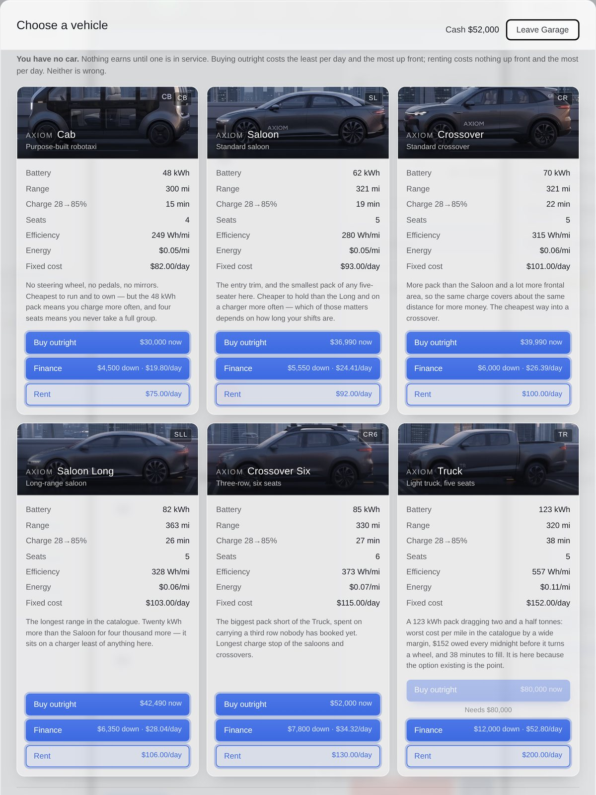
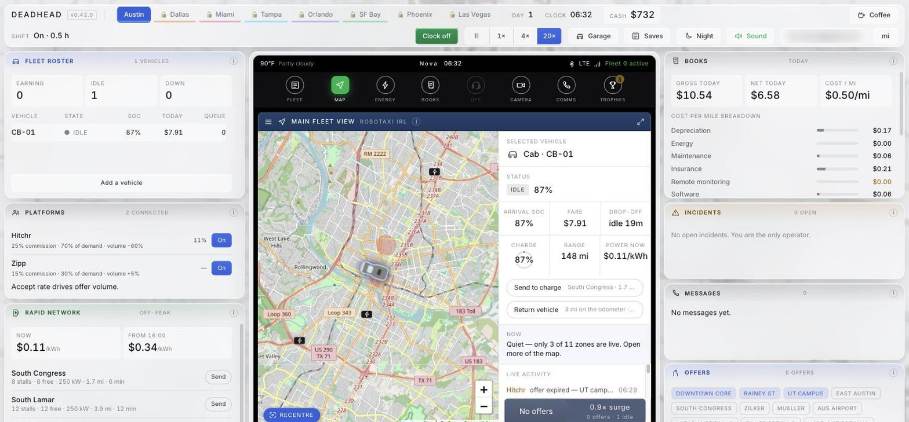
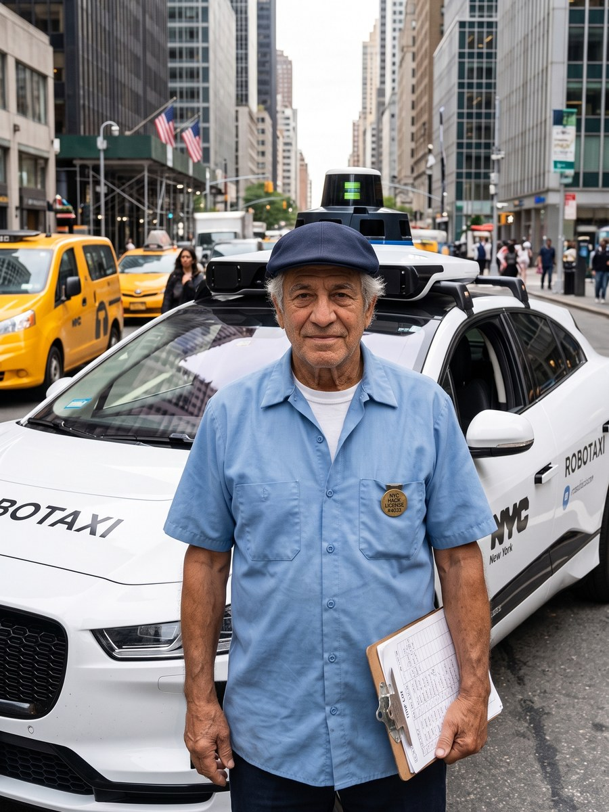
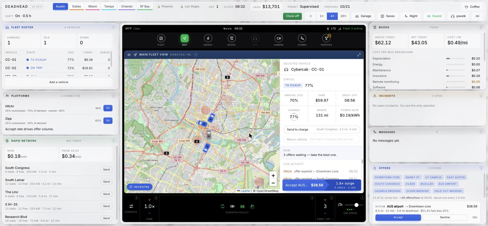
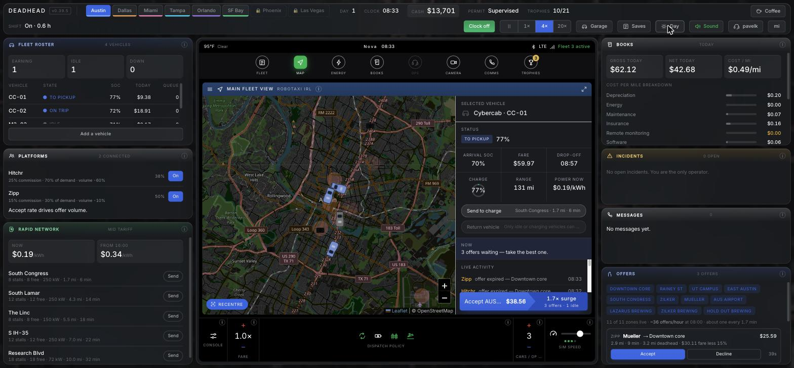

# DEADHEAD

### You never drive. That's the job.

**A robotaxi fleet simulator where you never touch a steering wheel.**

You are not the driver. You are the person the driver got replaced by — and the job turns
out to be harder. Six cars, six real cities mapped to the metre, and a spreadsheet
that bites. All of it happens on one screen: the car's own centre console.

> *Deadhead* — the trade word for driving with no fare aboard. It is the thing that quietly
> kills a robotaxi fleet's margin, and the reason this game is named after it.

| 💵 $800 | 🚗 6 | 🏙️ 6 | 📵 0 |
|:---:|:---:|:---:|:---:|
| starting cash | real vehicles | real cities | ads, ever |

## ▶ Play it now — [game.deadhead.workers.dev](https://game.deadhead.workers.dev/)

No install. No account. No download. It runs in the browser you already have.

---

## The first decision is the whole game

You start with **$800** and no car. Every vehicle in the catalogue costs many times that.

That is not a difficulty spike, it is the lesson. You cannot buy your way in, so you have to
choose *how you hold the asset* — and each way of holding it is wrong in a different way.

| | up front | per day | what it really costs |
|---|:---:|:---:|---|
| 🏦 **Buy outright** | $30,000+ | least | impossible on day one, and that's the point |
| 📄 **Finance** | 15% down | middling | a debt you cannot hand back |
| 🔑 **Rent** | nothing | most | the meter never stops. Ever. |

Renting costs nothing today and the most every day after. Financing is cheaper for exactly
as long as you keep working, and a mistake the moment you stop. **Neither is wrong.**

None of the six are financeable on day one — $800 doesn't clear a single down payment plus
lender reserve. Renting is the only door in; financing is a later move once you've earned
your way to it.

Day one, real numbers on screen. $30,000 and up is greyed out — not a lock, just arithmetic.

---

## Six cars, and the specs actually bite

The marque is invented; the physics is not. Every figure below is what purpose-built and
mass-market robotaxi hardware actually achieves in 2026, and the ladder between them —
48 kWh four-seat cab at one end, 123 kWh light truck at the other — is the real one. None
of it is flavour text; each spec feeds a system that is already running.

| | pack | range | seats | what it means for you |
|---|:---:|:---:|:---:|---|
| **Cab** | 48 kWh | 300 mi | 4 | no wheel, no pedals, cheapest to own — and on a charger constantly |
| **Saloon** | 62 kWh | 321 mi | 5 | the entry trim: cheap to hold, short on legs |
| **Crossover** | 70 kWh | 321 mi | 5 | more pack, more frontal area — same distance for more money |
| **Saloon Long** | 82 kWh | 363 mi | 5 | longest range here, and the last car you can finance on day one |
| **Crossover Six** | 85 kWh | 330 mi | 6 | biggest pack short of the truck, spent carrying a third row |
| **Truck** | 123 kWh | 320 mi | 5 | worst cost per mile by a mile, 38 minutes to fill, $152 every midnight |

Pack size decides how often a car is *earning nothing*. Energy per km decides what every
mile costs. Price decides whether you own a business or a debt. Choose badly and you won't
notice for two days.

---

## Six cities, one chain

Austin is the tutorial. Clock off your first shift there and Dallas unlocks; clock off in
Dallas and Miami unlocks; then Tampa, then Orlando, then San Francisco. Every city is a real
city where driverless ride-hailing is actually operating, built from its published service
area, real electricity tariff and real permit status — not a reskin with a new coat of paint.

**Austin** → **Dallas** → **Miami** → **Tampa** → **Orlando** → **San Francisco** → 🔒 New York → 🔒 Las Vegas

| city | permit | fleet cap | goal | what's actually true about it |
|---|:---:|:---:|---|---|
| 🎓 **Austin** | Supervised | 17 | up to $40,000 | the tutorial. Seven zones plus the airport, and Austin Energy's real five-hour evening peak |
| 🤠 **Dallas** | Unsupervised | 24 | up to $60,000, safety ≥ 70 | launched with no safety monitor at all. Highway-speed trips wear the car harder, but S Riverfront is 34 stalls at 325 kW — the best charging site in the game |
| 🌴 **Miami** | Unsupervised | 16 | up to $50,000, safety ≥ 75 | a tiny geofence with no airport and no downtown. FPL's peak runs nine straight hours, and Florida carries the harshest insurance rates in the table |
| 🌇 **Tampa** | Unsupervised | 14 | up to $45,000 | the exact mirror of Miami: all core, no suburbs, and an evening rush instead of a morning one — plus the cheapest overnight power in the game, if the fleet can wait for it |
| 🎢 **Orlando** | Unsupervised | 14 | up to $42,000 | a corridor that runs past MCO without touching it. No airport zone, no brewery zones, the thinnest demand of the six — and the cheapest power of all of them |
| 🌉 **San Francisco** | Supervised | 12 | **$100,000**, safety ≥ 75 | still invite-only in reality, hence the smallest fleet in the game. PG&E's off-peak price alone beats every other city's peak. Highest insurance, worst congestion — and the first city where the airport run is real |

Every city but San Francisco's "goal" is an optional ceiling — a bar to chase, not a
requirement to move on (that's just one clean shift). San Francisco's $100,000 is the one
that's real: it's checked against the whole fleet's banked cash and gates the game's ending.

Nothing above is tuned for difficulty after the fact. Where the real service area excludes
downtown, the airport, or every brewery in town, the game excludes it too.

New York and Las Vegas sit at the end of the tab strip, padlocked — a graphic mockup with no
scenario behind either yet. New York is Paolo's own city, the one he actually drove a cab in
for forty-one years; nobody is running these cars there today. Click one of the two and
Paolo says so, in his own words, rather than the tab simply doing nothing.

---

## What you actually do

**Clock on.** Cars only earn while you are watching them — you are the remote operator.
Clock off and they park, and still owe their fixed cost at midnight. A four-hour shift owns
a car that sits idle for twenty hours and gets billed for all of them. That is the most
accurate thing this game says about gig work, and it arrives as arithmetic rather than a
speech.

**Read the offers.** Three numbers on every one: what the meter says, what you actually keep
after commission, and how far you drive empty to reach the passenger. The third decides
whether you made money.

**Play the tariff.** Every city runs its own real utility's time-of-use pricing — Austin
Energy, Oncor, FPL, TECO, OUC, PG&E — so "charge at 4am" means something different, and is
worth a different amount, in each one. In Austin, power is $0.11/kWh before 07:00 and $0.34
through the evening peak. Real fast-charging sites back it: South Congress is 2.5 km away; Research
Boulevard never queues because it has 18 stalls, but it's 27 minutes out and charges at only
72 kW. Miami flips the clock entirely — FPL's peak runs noon to 9pm, nine hours instead of
five — Tampa's off-peak, at 7.5c/kWh, is the cheapest power in the whole game — and San
Francisco breaks the pattern outright: PG&E's real off-peak price alone beats every other
city's peak, so "charge overnight" stops being the free answer it is everywhere else.

**Draw the map.** Every city has its own zones and its own demand curve by hour, and no two
read the same way. Austin has seven zones plus Austin-Bergstrom — Rainey Street pays at 2am,
UT campus pays at 8am, the airport pays $30 a run and leaves your car 21 minutes from
everything else. Miami and Orlando have no airport zone at all, because the real geofences
don't reach one. Tampa's evening is the busiest hour in the game once its three Ybor taproom
zones are live; Orlando has no brewery zones, because the real ones sit outside its corridor.
San Francisco's airport zone is the one exception — SFO only joined the real service map days
before this scenario shipped, so it's the first city where the airport run is genuinely live.

**Take control.** When a car gets wedged, the console switches to its camera feed and you
drive it out yourself. Entirely optional — the incident clears on its own eventually.
Whether "eventually" is soon enough is your problem.

---

## Real data, not set dressing

|   |   |
|---|---|
| ✅ **Six real geofences** | Austin, Dallas, Miami, Tampa, Orlando, San Francisco — each drawn from the actual published or reported service area, not a symmetric shape dropped on the map |
| ✅ **Live weather** | for whichever city you're in, and its real local clock |
| ✅ **Real charging sites** | in every city, with actual coordinates, stall counts and peak kW — a 72 kW site charges slower because it genuinely does |
| ✅ **Real fares** | calibrated against observed prices in each market: about $18 for a downtown Austin hop, $29–32 from Austin's airport, and a different scale entirely in each other city |
| ✅ **Real MSRP** | on all six cars, with a cost side scaled to match |
| ✅ **Real time-of-use electricity** | from each city's actual utility — Austin Energy, Oncor, FPL, TECO, OUC, PG&E — which is why charging at 4am is a strategy in most cities and barely worth it in San Francisco, where even the cheap hour is dear |

Everything *around* the hardware — Hitchr, Zipp, Meridian, Halo — is invented. The cars and
the numbers are not. That line is deliberate.

---

## Paolo

Forty-one years in a cab before he got out, while getting out was still his idea. He walks
you through your first day, then goes quiet — and speaks again only once you've been stuck
long enough to need it. He isn't a tooltip. He has opinions about what you're doing, and
he's usually right.

A standing **Now** line always names the single most useful next thing, so you're never
lost. It never tells you what to *choose*.

 

---

## Also in the box

- 💾 Save anywhere, or sign in for cloud saves synced across devices
- 🌗 Light and dark themes
- 📱 Works on a phone, a laptop and an ultrawide — the layout genuinely reworks itself
- 🔒 Passwords are never transmitted: key derivation runs in your browser
- 📄 One HTML file, no build step — [download it](deadhead.html) and it runs offline

---

## Buy Paolo a coffee

Deadhead is free and stays free. No ads, nothing behind a paywall, no second version that
costs money. If it turned out to be worth something to you, there's a tip jar — and if it
didn't, that's completely fine.

There's a **Coffee** button in the top right of the game, too. Paolo will ask you himself.

---

### [▶ Play Deadhead](https://game.deadhead.workers.dev/)

Building or deploying it? See **[DEVELOPING.md](DEVELOPING.md)**.

Deadhead is an independent work of fiction. It is not affiliated with, endorsed by,
sponsored by or connected to any vehicle manufacturer or ride-hailing operator, and it uses
no manufacturer's name, badge, model names or photographs. Every company, vehicle, platform
and commercial term in the game — Axiom, Hitchr, Zipp, Meridian, Halo — is invented. What is
real is the arithmetic: the service areas, electricity tariffs, permit regimes and observed
street fares are drawn from public information, because a simulation whose numbers you can
check is the only kind worth arguing with.

